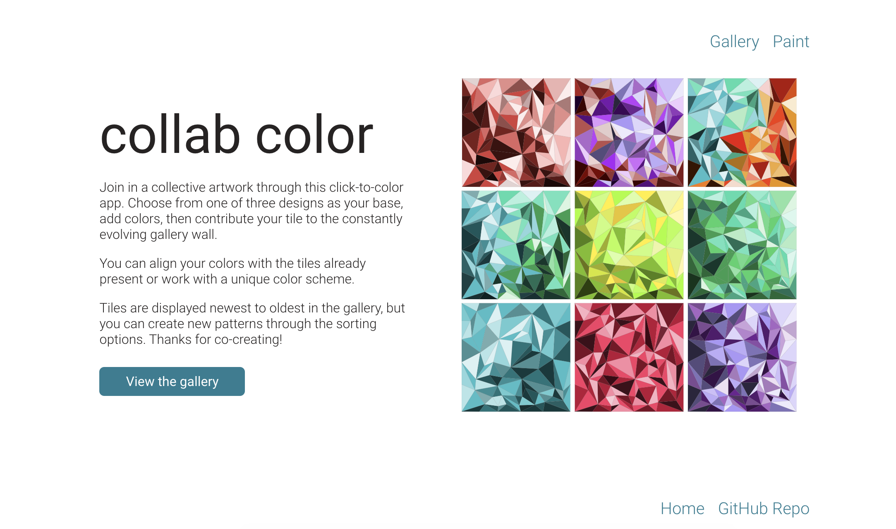
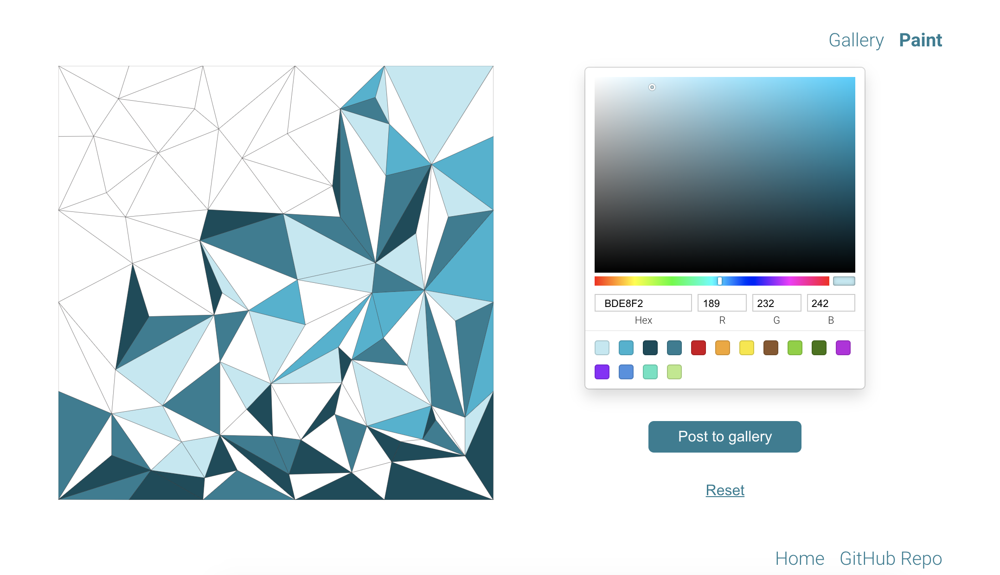
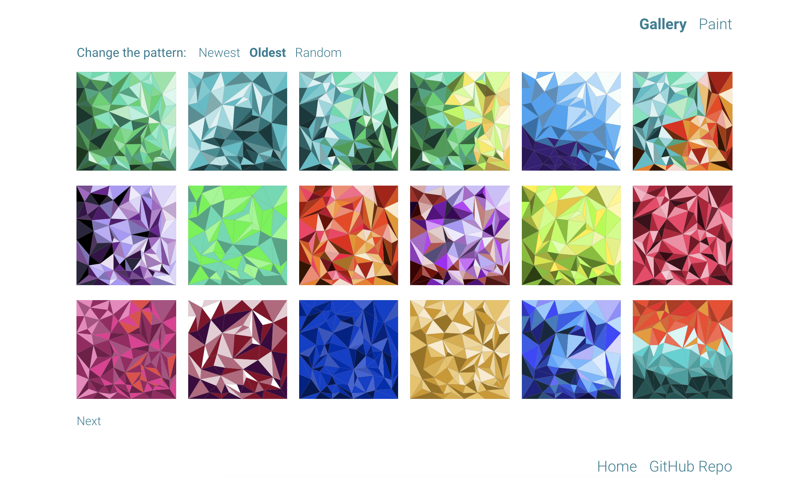

# Collab-Color

## Description
Contribute to a collective artwork by coloring in one or more tiles through this click-to-color app. 
 

Users can choose from one of three canvases and add colors by clicking individual shapes.
 

On the gallery page, users can see their artwork displayed alongside other contributions. The gallery pattern can be transformed by applying a new sorting method: newest (default), oldest, or random.
 

## Technology
This frontend repo connects to a Rails API backend and was built with the [create-react-app](https://github.com/facebook/create-react-app) generator and Redux. Redux Thunk middleware is used to handle asynchronous actions. Canvases and paintings are SVGs. 

[Backend Repo](https://github.com/staceymck/collab-color-backend)

## License
The project is available as open source under the terms of the [MIT License](https://opensource.org/licenses/MIT).